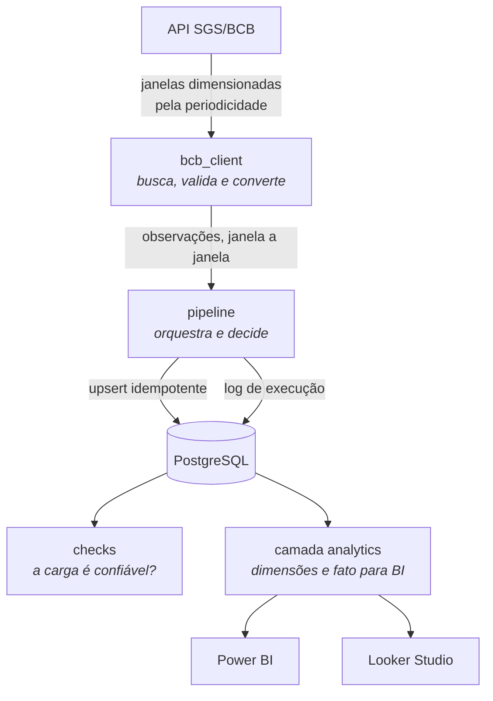
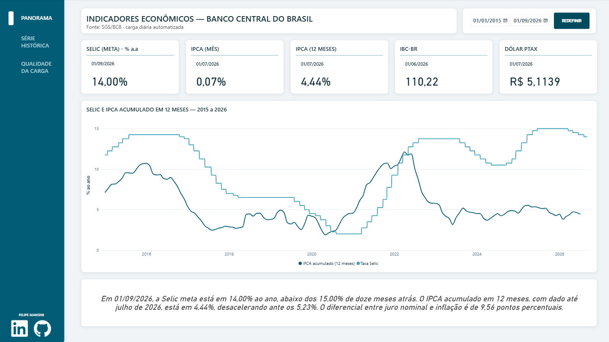
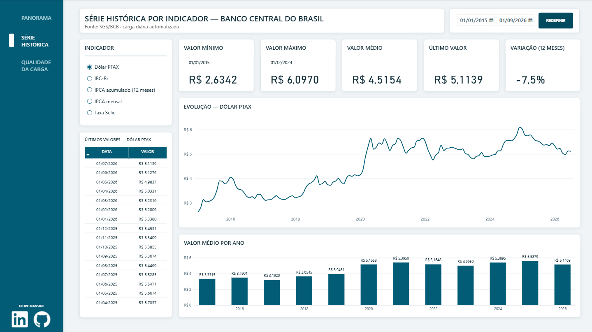
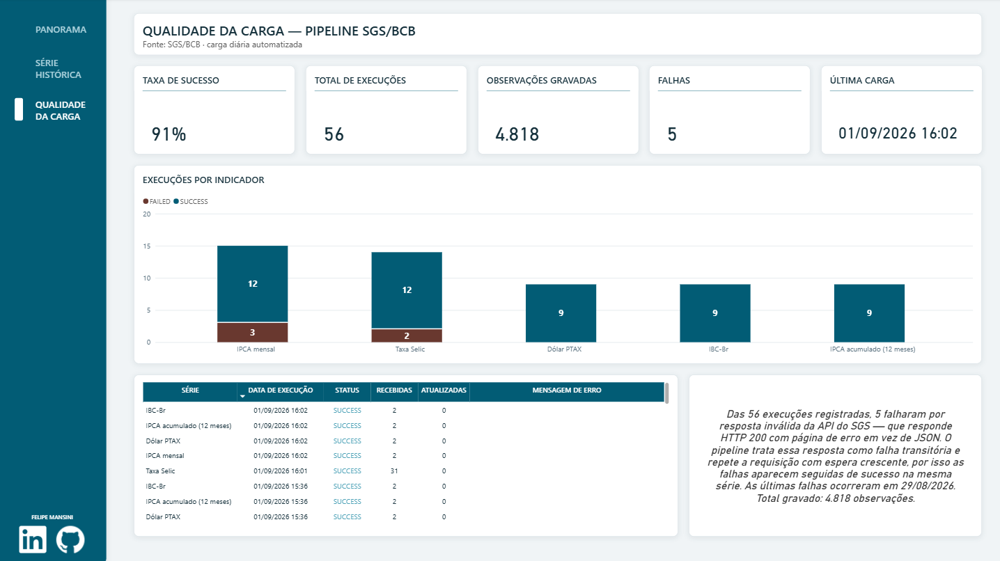

# pipeline-indicadores-bcb


Pipeline de ingestão de indicadores econômicos do Banco Central (SGS/BCB) para PostgreSQL, com carga incremental idempotente, retomada após falha, validação de dados e execução diária automatizada.

Projeto pessoal, construído para exercitar em dado público os mesmos padrões que uso em produção: integração com API instável, escrita idempotente, log de auditoria e verificação de qualidade antes de o dado chegar em quem decide.

**[Abrir o dashboard público →](https://datastudio.google.com/reporting/387b4bf3-1c9c-4a06-9dc5-3f596da96aae)**

---

## O que ele faz

Coleta séries do Sistema Gerenciador de Séries Temporais do Banco Central, grava em PostgreSQL de forma que executar duas vezes não duplique nada, registra cada execução e valida o resultado.

Séries acompanhadas hoje: Selic meta, IPCA mensal, IPCA acumulado em 12 meses, dólar PTAX médio mensal e IBC-Br.



## Modelo de dados

| Tabela | Papel |
|---|---|
| `bcb.series` | Catálogo dos indicadores. Governa o comportamento da coleta: periodicidade define o tamanho da janela, defasagem esperada define o limite de alerta, nome curto define o rótulo em interface. |
| `bcb.observations` | Os valores no tempo. Chave primária composta `(series_code, reference_date)`. |
| `bcb.runs` | Log de auditoria: uma linha por série por execução, com status, contagens e mensagem de erro. |

Sobre essas tabelas existe o schema `analytics`, com um modelo estrela para consumo em BI:

| Objeto | Papel |
|---|---|
| `dim_series`, `dim_calendar`, `fct_observations` | Modelo estrela, base do relatório em Power BI. |
| `v_series_latest` | Último valor de cada série, com variação e defasagem. |
| `v_pipeline_health` | Histórico de execuções, já convertido para o fuso de Brasília. |
| `v_bi_observations` | View desnormalizada (fato mais dimensões) para ferramentas que consomem uma tabela só. |

## Operação

A carga roda **diariamente às 07:00 (horário de Brasília) pelo GitHub Actions**, contra um PostgreSQL gerenciado. A validação de qualidade roda em seguida e reprova a execução quando encontra erro, então uma falha aparece como execução vermelha na aba Actions em vez de passar despercebida.

O banco começou local e foi migrado para nuvem **sem alterar uma linha de código** — apenas a variável `DATABASE_URL`. Foi o que permitiu tirar a execução da máquina pessoal.

O acesso das ferramentas de BI é feito por um usuário separado, somente leitura, distinto do usuário que o pipeline usa para escrever.

## Como rodar

Requer Python 3.10+ e um PostgreSQL acessível.

```bash
git clone https://github.com/mrmansini/pipeline-indicadores-bcb.git
cd pipeline-indicadores-bcb

python -m venv .venv
source .venv/bin/activate        # Windows: source .venv/Scripts/activate
pip install -r requirements.txt

cp .env.example .env             # preencha a DATABASE_URL
```

Crie o schema, na ordem:

```bash
psql "$DATABASE_URL" -f sql/001_schema.sql
psql "$DATABASE_URL" -f sql/002_fix_series_metadata.sql
psql "$DATABASE_URL" -f sql/003_add_max_lag_days.sql
psql "$DATABASE_URL" -f sql/004_analytics_views.sql
psql "$DATABASE_URL" -f sql/005_fix_encoding.sql
psql "$DATABASE_URL" -f sql/006_add_short_name.sql
psql "$DATABASE_URL" -f sql/007_bi_reader.sql
psql "$DATABASE_URL" -f sql/008_fix_pipeline_health.sql
```

Execute:

```bash
python src/pipeline.py                 # carga incremental de todas as séries
python src/pipeline.py --series 433    # apenas uma série
python src/pipeline.py --full          # recarrega desde a data inicial
python src/checks.py                   # valida o que está no banco
```

O `checks.py` sai com código 1 quando encontra erro, o que permite usá-lo como portão: carga que não passa na validação não deveria alimentar dashboard.

## Decisões técnicas

**Idempotência na estrutura, não no código.** A chave primária `(series_code, reference_date)` impede fisicamente que a mesma observação entre duas vezes. O `ON CONFLICT ... DO UPDATE` com `WHERE value IS DISTINCT FROM EXCLUDED.value` completa: se o valor não mudou, a linha não é tocada. Numa recarga, `recebidas` fica alto e `inseridas + atualizadas` fica em zero — o que sobra é o que já estava correto.

**Carga incremental com 30 dias de sobreposição.** O pipeline não retoma exatamente de onde parou: ele volta 30 dias. Índice econômico é revisado depois de publicado, e retomar do último dia faria o banco divergir da fonte em silêncio. Como a escrita é idempotente, reprocessar essa sobreposição não custa nada.

**Commit por janela, com parada no primeiro buraco.** A coleta entrega janela a janela e grava cada uma. A falha da nona janela não custa as oito anteriores. Mas a exceção interrompe a série inteira em vez de pular para a décima — e isso é deliberado: como a retomada é calculada por `MAX(reference_date)`, pular por cima de uma janela criaria uma lacuna que a carga incremental nunca voltaria para preencher, porque ela só olha para frente.

**O catálogo governa o comportamento.** Periodicidade define o tamanho da janela de coleta; defasagem esperada define o limite de alerta de atualidade; nome curto define o rótulo em interface. Adicionar uma série nova é um `INSERT`, não uma alteração de código. O efeito colateral é que metadado errado vira comportamento errado — foi o que aconteceu, e está descrito abaixo.

**Regra de negócio no banco, apresentação no BI.** A camada `analytics` entrega o dado com o significado já resolvido, em views versionadas em Git. Ferramenta de BI cuida de recorte, filtro e visual. Foi essa separação que permitiu apontar mais de uma ferramenta para o mesmo modelo sem reescrever nada.

**O fuso é resolvido na camada de consumo.** `bcb.runs` grava em UTC, que é o certo para dado bruto. A conversão para o horário de Brasília acontece em `v_pipeline_health`, para que o painel exiba a carga das 07:00 como 07:00 sem que cada ferramenta precise saber disso.

**`NUMERIC`, não `FLOAT`.** Valor econômico não admite erro de arredondamento binário.

## O que a API não conta na documentação

Esta seção existe porque foi a parte mais cara do projeto, e o que aprendi aqui não está em tutorial nenhum.

**O SGS responde 200 com HTML quando não gosta do pedido.** Não é 400, não é 403, não é 429 — é uma página XHTML de "Requisição inválida" com status 200. Qualquer código que confie no status como sinal de sucesso vai tentar interpretar HTML como JSON e falhar em outro lugar, sem relação óbvia com a causa.

**A consulta por período exige duas condições simultâneas.** Descobertas por isolamento de variável, uma por vez:

| URL | Cabeçalho | Resultado |
|---|---|---|
| datas via `params` do requests | padrão | HTML |
| datas via `params` | `User-Agent` de navegador | HTML |
| datas embutidas na URL | padrão | HTML |
| **datas embutidas na URL** | **`User-Agent` de navegador** | **JSON** |

O `params` do requests codifica as barras da data como `%2F`, e o SGS exige a barra literal. E o `User-Agent` padrão da biblioteca é recusado. Uma condição sem a outra não passa.

**O limite de janela é por volume, não por tempo.** Para a Selic (diária), 5 anos e 2 anos devolvem HTML; 1 ano e 6 meses devolvem JSON. Para séries mensais, 5 anos passam sem problema. Daí a janela ser dimensionada pela periodicidade declarada no catálogo.

**E mesmo atendendo tudo, a falha ainda ocorre de forma intermitente.** A mesma requisição devolve JSON numa hora e HTML na seguinte, sem padrão de horário ou volume. Por isso o cliente valida o `content-type` antes de interpretar a resposta e trata resposta não-JSON como falha transitória, com novas tentativas e espera crescente. Numa carga completa da Selic — 12 janelas —, tipicamente duas falham e se recuperam na segunda tentativa.

A página de qualidade do dashboard mostra isso acontecendo: as falhas registradas aparecem seguidas de sucesso na mesma série, que é a recuperação automática visível no log.

## Validação de qualidade

O pipeline responde "a carga rodou?". O `checks.py` responde "dá para confiar no que está no banco?".

A distinção não é acadêmica. Durante a construção, a série 3698 carregou sem nenhum erro, reportou sucesso e trouxe **o dado errado**: o catálogo dizia diária, mas 3698 é a média mensal do PTAX, não a cotação diária. Nenhuma verificação de execução pegaria isso. Só a conferência do dado pega — e foi uma contagem manual que denunciou, 139 observações em 11 anos.

As seis validações:

| Verificação | O que procura |
|---|---|
| Séries sem dado | Série ativa no catálogo sem nenhuma observação |
| Valores nulos | Percentual de observações sem valor, com limite de severidade |
| Periodicidade × dado | Intervalo mediano observado versus periodicidade declarada — a que teria pego o erro acima no primeiro segundo |
| Lacunas no histórico | Mensal: meses faltando entre a primeira e a última. Diária: saltos que feriado não explica |
| Defasagem | Última observação versus limite próprio da série |
| Execuções com falha | Falha **sem sucesso posterior** para a mesma série |

Os dois últimos foram calibrados contra alarme falso, e por um motivo: alerta que dispara para problema já resolvido treina as pessoas a ignorar alerta, e alerta ignorado é pior que alerta nenhum, porque dá sensação de cobertura que não existe. A defasagem aceitável saiu de um valor por periodicidade para um valor por série, porque IPCA e IBC-Br são ambos mensais mas o segundo é divulgado com dois meses de atraso. E a checagem de falhas passou a ignorar erro que o pipeline superou sozinho na execução seguinte.

## Visualização

Duas ferramentas apontam para a mesma camada `analytics`, sem transformação intermediária. A regra de negócio está no banco; cada ferramenta cuida só de recorte e apresentação.

Ambos os relatórios têm três páginas: panorama dos indicadores, série histórica com exploração por indicador, e saúde da carga.

Essa última é a menos comum e a que eu considero mais importante: ela mostra a taxa de sucesso das execuções, o volume gravado e as falhas com a mensagem de erro. Um painel que não expõe a saúde da própria carga esconde justamente o que o leitor precisa para confiar no número.

### Looker Studio / Data Studio

**[Abrir o dashboard →](https://datastudio.google.com/reporting/387b4bf3-1c9c-4a06-9dc5-3f596da96aae)**

Conectado diretamente ao PostgreSQL, com usuário somente leitura e conexão criptografada. É a versão pública e atualiza sozinha.

### Power BI

Modelo estrela sobre `dim_series`, `dim_calendar` e `fct_observations`, com medidas em DAX para valor atual, comparação com doze meses atrás e leitura automática do panorama em texto corrido. O arquivo `.pbix` está versionado em `powerbi/`.







## Limitações e próximos passos

- **Sem testes automatizados.** A validação cobre o dado, não a lógica. Teste de unidade sobre o janelamento e o parsing é o próximo passo natural, e a ausência é uma dívida consciente.
- **A janela de 30 dias de sobreposição é fixa.** Suficiente para revisão de índice mensal, mas é um número escolhido por bom senso, não medido contra o histórico real de revisões.
- **Sem histórico de revisão.** Quando um valor é revisado, o anterior é sobrescrito. Guardar a versão antiga permitiria responder "o que a gente sabia naquela data?" — pergunta relevante em análise econômica.
- **A falha não notifica ninguém.** Ela fica visível na aba Actions, o que resolve para um projeto pessoal, mas não equivale a alerta ativo.
- **O `.pbix` não atualiza sozinho.** A carga é automatizada, mas o relatório em Power BI depende de refresh manual no Desktop. O Looker Studio consulta o banco direto e não tem essa limitação.

## Estrutura

```
├── .github/workflows/
│   └── pipeline.yml                   carga diária automatizada
├── sql/
│   ├── 001_schema.sql                 estrutura inicial
│   ├── 002_fix_series_metadata.sql    correção de periodicidade
│   ├── 003_add_max_lag_days.sql       defasagem esperada por série
│   ├── 004_analytics_views.sql        camada analítica para BI
│   ├── 005_fix_encoding.sql           correção de encoding
│   ├── 006_add_short_name.sql         nome curto para exibição
│   ├── 007_NOME_DO_ARQUIVO.sql        (preencher)
│   └── 008_fix_pipeline_health.sql    fuso de Brasília e nome curto na saúde
├── src/
│   ├── config.py                      variáveis de ambiente e constantes
│   ├── bcb_client.py                  cliente do SGS: janelamento, retry, parsing
│   ├── db.py                          conexão, upsert e log
│   ├── pipeline.py                    orquestração
│   └── checks.py                      validações de qualidade
├── powerbi/
│   └── indicadores-bcb.pbix           relatório do Power BI
├── docs/
│   ├── tema-bcb-institucional.json    tema do relatório
│   ├── powerbi-overview.png           página 1 — panorama
│   ├── powerbi-time-series.png        página 2 — série histórica
│   └── powerbi-data-quality.png       página 3 — qualidade da carga
├── .env.example
└── requirements.txt
```

---

Felipe Mansini · [LinkedIn](https://linkedin.com/in/felipemansini)
